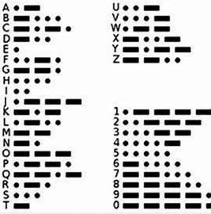
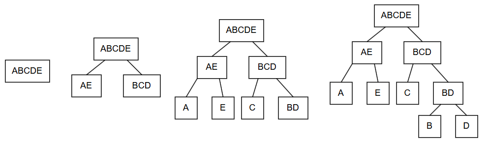
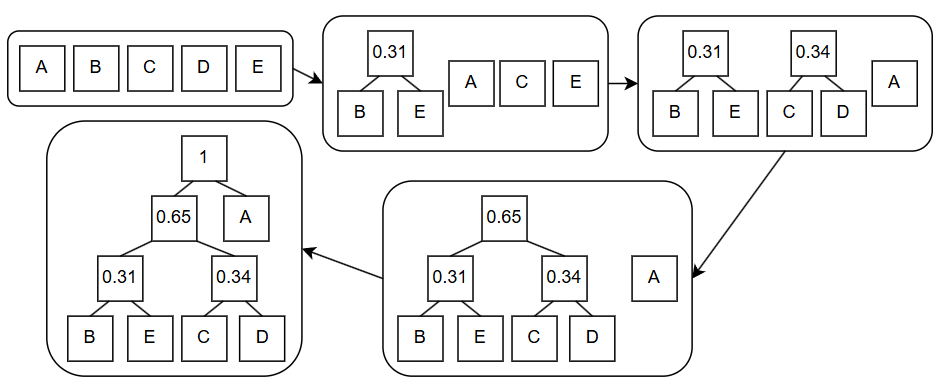
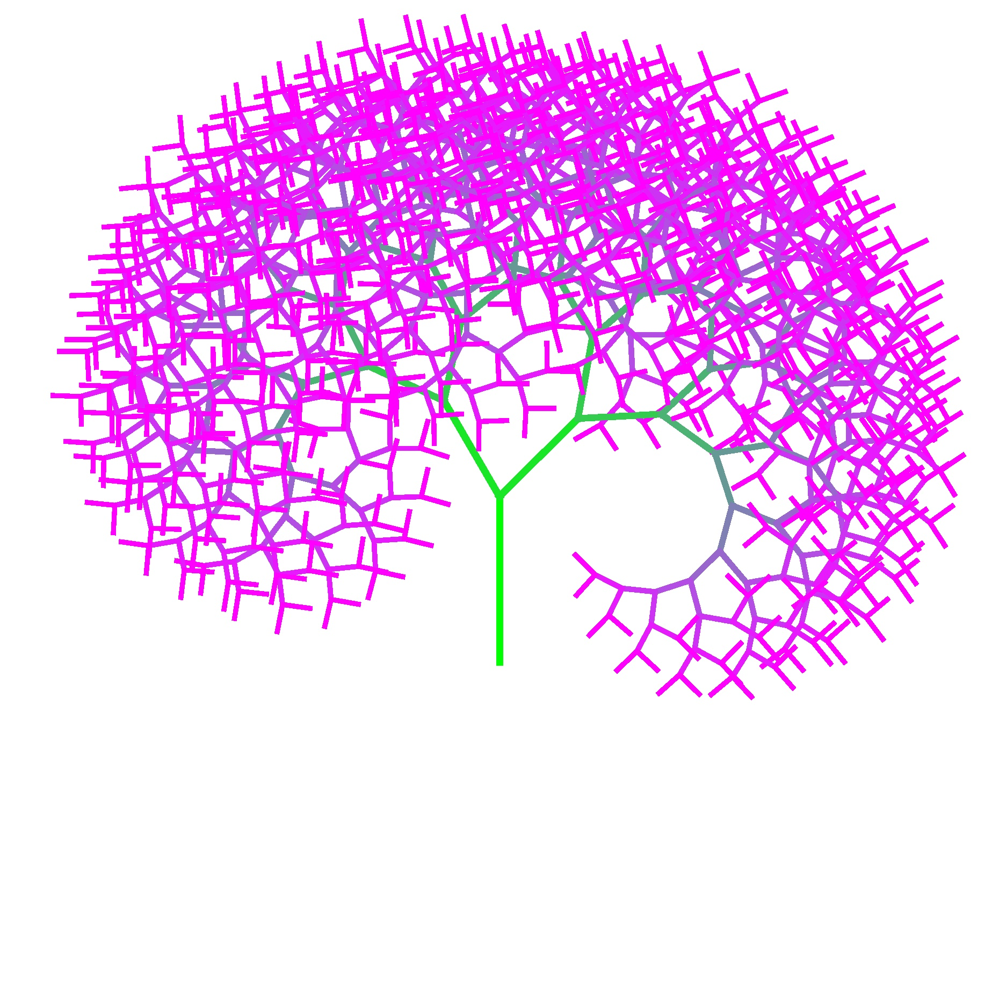

Today, we are going to discuss a very common and interesting algorithm: compression. I believe everyone has encountered compressed archives more or less when downloading resources, but I wonder if you have ever thought about how they work? Why can a relatively **small** compressed file be converted into the original **large** file without any **loss** in the large file? In this article, I will explain the basic principles of compression algorithms and discuss some parts of compression theory that I find very interesting.

## Introduction

In computers, all information is represented by 0s and 1s. We can use one byte (8 binary bits) to represent an [ASCII](https://en.wikipedia.org/wiki/ASCII) character. However, in a text file, we might not use all the available characters, so we could represent a character with a shorter binary string.

However, just doing this is not enough. Let's consider the example of Morse code. In Morse code, there are two symbols, $\cdot$ and $-$, which is very similar to our computers.



Moreover, the longest character in Morse code only has 5 symbols, which is shorter than an ASCII code. So, could we simply use Morse code as a compression algorithm?

If you have this idea, consider this question: please translate $--\cdot --\cdot$. By checking the Morse code table, we can find that this segment of Morse code has multiple possibilities: "GG", "MEME", ... In real-world usage, we can distinguish them by adding pauses between words, but this essentially uses three symbols ($\cdot$, $-$ and pause), which cannot be implemented in a computer using just binary.

Therefore, we hope that in our compressed encoding, the compressed code of one character is not a prefix of the compressed code of another character. This way, when we recognize a character, we can ensure that this binary string exclusively represents this character, and cannot combine with the following binary string to form another character. We call such encoding **prefix-free**.

> For example: "A: 0, B: 10, C: 11" is a prefix-free encoding, so the binary string "01011" can be uniquely converted to "ABC";
> 
> "A: 0, B: 01, C: 10" is not a prefix-free encoding (A is a prefix of B), so the binary string "010" could be either "AC" or "BA".

*Therefore, the goal of a compression algorithm is to **find a prefix-free encoding**, and convert the source file into a compressed file according to this encoding. During decompression, we only need to traverse the compressed file against the **same set of encoding** to restore the source file.*

We will find that in this encoding system, each character is allowed to have a different length of binary representation. Then, in order to compress the file as much as possible, we also hope to ensure that **characters with higher appearance frequencies have shorter binary representations**.

> For example: We have a text like this: "AAAAAAAAAB", let's compare the following two encoding methods:
> - "A: 0, B: 10": The compressed file is: "00000000010", its length is 11.
> - "A: 01, B: 1": The compressed file is: "0101010101010101011", its length is 19.

**So, how can we find such an encoding system?**

## Shannon-Fano Coding

[Shannon-Fano coding](https://en.wikipedia.org/wiki/Shannon%E2%80%93Fano_coding) is a prefix-free encoding system. Its encoding steps are:
1. Count the appearance frequency of each character.
2. Divide these characters into two groups so that the sum of the frequencies of the characters in each group is approximately 0.5.
3. Repeat step 1 for each group of characters until a group contains only one character.

For the following file:

| Character | Frequency |
| :---: | :---: |
|   A   | 0.35  |
|   B   | 0.16  |
|   C   | 0.17  |
|   D   | 0.17  |
|   E   | 0.15  |

The visualization process of the encoding is as follows:



Finally, we get a binary tree (a tree where each node has at most two child nodes). We can stipulate that all left branches in this tree are 0 and right branches are 1, then we get the encoding: "A: 00, B: 110, C: 10, D: 111, E: 01".

It can be found that since all letters are leaf nodes of the tree (nodes without child nodes), it is impossible for the encoding of one character to be the prefix of the encoding of another character, hence this encoding is prefix-free.

Assuming there are 100 characters in the file, this encoding can compress the original file ($8 \times 100 = 800$ bits) into a

$$35 \times 2 + 16 \times 3 + 17 \times 2 + 17 \times 3 + 15 \times 2 = 233$$

bit compressed file. That's great!

**But can we do better?**

## Huffman Coding

Based on Shannon-Fano coding, Huffman invented a bottom-up encoding system. Its steps are:
1. Count the appearance frequency of each character.
2. From all symbols, select the two symbols with the lowest appearance frequencies and combine them into a new symbol, whose appearance frequency is the sum of the two symbols.
3. Repeat the second step until only one symbol remains.

For the example in Shannon-Fano coding, the Huffman coding process is as follows:



Similarly, if we treat the left branch as 0 and the right branch as 1, we can get the following Huffman encoding: "A: 1, B: 000, C: 010, D: 011, E: 001".

**Which encoding method is actually better?** For a source file with 100 characters, the length of the compressed file obtained using Huffman coding is:

$$35 \times 1 + 65 \times 3 = 230$$

In fact, Huffman coding is an optimal compression algorithm.

## Compression Theory

Looking at it this way, compression should be very easy, right? To understand this question, let's consider the essence of compression. Compression is essentially using a short binary string to represent the complete information of a long binary string.

Let's consider a compression algorithm: if the input is `CompleteWorksOfShakespeare.txt`, it compresses it into a 0-bit binary string (i.e., an empty string); if any other file is input, it outputs the original file minus the first bit. In this way, we can compress the complete works of Shakespeare down to 0 bytes (or even 0 bits)! Is such a compression algorithm a good algorithm?

**Obviously not.** First, this algorithm is not general: for texts other than the complete works of Shakespeare, an algorithm capable of lossless decompression cannot be written. Second, for the complete works of Shakespeare, the decompression algorithm must contain the text of this book to be able to output it. Therefore, this algorithm essentially stores the information in the decompression algorithm.

To fairly evaluate a compression algorithm, we need to establish the following compression model:

```mermaid
Compressed File: Compressed binary string + Decompression algorithm ---> Some computing environment ---> Source file
```

That is to say, the smaller the total length of the compressed binary string + decompression algorithm, the better the compression algorithm.

From now on, what we discuss as the **meaning of a compressed file is the sum of the compressed binary string and the decompression algorithm binary string**. Intuitively, such a file contains **all the information** we need to restore the file.

Now, let's consider the essence of compression again: using a short binary string to represent the complete information of a long binary string. An n-bit binary string has $2^n$ possible combinations, which means that the information that can be saved by a short string must be less than that of a long string. For an n-bit binary string, the sum of all possibilities of binary strings shorter than it is only $2^n - 1$, which means that **at least one n-bit binary string** is incompressible.

> In reality, decompression software contains enough information to ensure that most files can be "compressed". But if we count the size of the decompression software, the size of these compressed archives will mostly be larger than the original ones. However, since the compression algorithm is universal, the information in it can be reused by different files, so in practice, this is also a way to solve the compression problem.

In fact, under the compression model we have defined, an algorithm capable of compressing all files is an [NP-complete problem](https://en.wikipedia.org/wiki/NP-completeness).

In the process of exploring the compression problem, many people have put forward bizarre ideas. Next, we are going to discuss an idea that I find very interesting: comprehensible compression.

### Comprehensible Compression

I recently used code to create a recursive art painting:



The space occupied by this image is 1,012,048 bytes. Compressing it with 7z results in a file size of 885,886 bytes. But, what if I claimed that I could compress this image down to 1,830 bytes, what would you think?

In fact, I have already done it, and the "compressed file" is exactly **the code needed to generate this recursive painting**.

So, is it possible to design a compression algorithm that can output a piece of code, and the output of this code is the source file?

> First of all, there is currently no such algorithm, this is more of a thought experiment.

[Scott Aaronson](www.scottaaronson.com/papers/npcomplete.pdf) argues that if we can compress some complex things, like the stock market or human genes, into comprehensible code, then by analyzing this code, we can get a glimpse into the essence of these things; that is, we can compress what we understand, and the things we understand are also what we can predict.

- To me, I think this idea nicely interprets the original intention of my writing these articles (which is also a form of compression for me).
- However, opponents argue that code is not necessarily comprehensible.

---

I feel my explanation of comprehensible compression is a bit confusing (probably because I haven't fully understood it myself either lol). But I think such an idea is very interesting, so I am sharing it with you here. Those interested can read Scott Aaronson's original article.