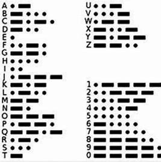
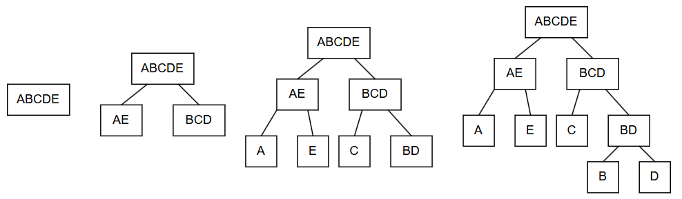
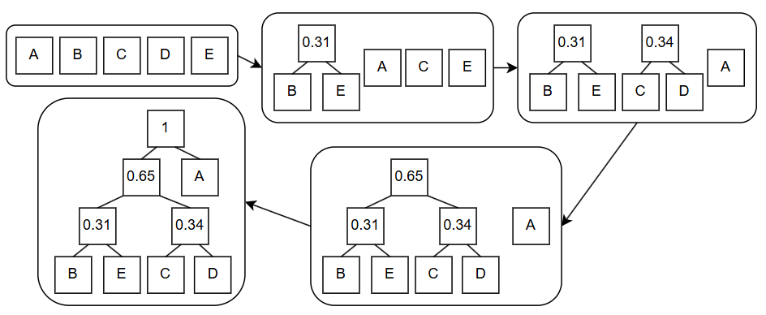
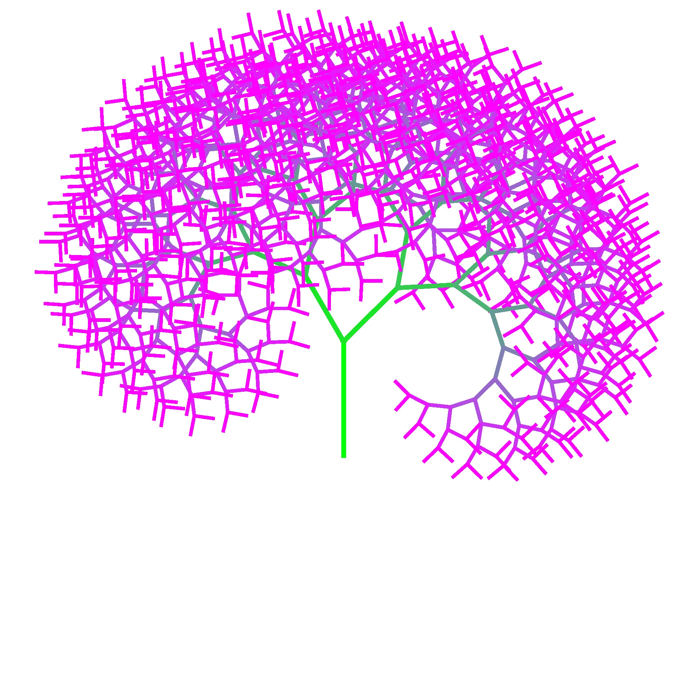

今天, 我们要讨论一个十分常见且有趣的算法: 压缩. 相信大家遇到过下载资源时或多或少都碰到过压缩包吧, 但不知道大家有没有思考过它们是如何工作的? 为什么能将压缩包这个比较**小**的文件转换成原来的**大**文件, 且大文件也**没有损失**呢? 在这篇文章中, 我将讲解压缩算法的基本原理, 并讨论一些压缩理论中让我十分感兴趣的部分. 

## 概论

在计算机中, 所有信息都是用0和1表示的. 我们可以用一个字节(8个二进制位)表示一个[ASCII](https://en.wikipedia.org/wiki/ASCII)字符. 然而, 在一个文本文件中, 我们可能不会用到其中所有的字符, 因此我们可以通过用更短的二进制串表示一个字符. 

然而, 仅仅这样也是不够的. 让我们来考虑一个摩尔斯电码的例子吧. 在摩尔斯电码中, 有 $\cdot$ 和 $-$ 两种符号, 这与我们的计算机十分相似. 



而且, 摩尔斯电码中最长的字符也只有5个符号, 比一个ASCII码要短. 那我们能不能干脆用摩尔斯电码作为一种压缩算法呢? 

要是你有这种想法, 不妨考虑这样一个问题: 请翻译 $--\cdot --\cdot$ . 对照摩尔斯电码表我们可以发现, 这段摩尔斯电码有多种可能: "GG", "MEME", ... 在现实使用过程中, 我们可以通过在字与字之间添加停顿来达到区分的目的, 但是这样实质上是使用了三种符号( $\cdot$ , $-$ 和停顿), 在计算机中并不能够实现. 

因此, 我们希望在我们压缩后的编码中, 不存在一个字符的压缩码是另一个字符的前缀. 这样, 当我们识别出一个字符后, 我们就能够确保这段二进制串就是代表这个字符, 而不可能和后面的一段二进制串共同组合成一个其他字符. 我们称这样的编码是**前缀不重复**的. 

> 举个例子来说: "A: 0, B: 10, C: 11"是一个前缀不重复编码, 因此二进制串"01011"能被唯一转化成"ABC"; 
> 
> "A: 0, B: 01, C: 10"不是一个前缀不重复编码(A是B的前缀), 因此二进制串"010"既可能是"AC", 也可能是"BA"

*因此, 一个压缩算法的目的就是**找到一个前缀不重复编码**, 并按照该编码将源文件转化为一个压缩文件. 在解压缩时, 我们只需要对照**同一套编码**遍历压缩文件, 就能恢复得到源文件.* 

我们会发现, 这套编码中每个字符是允许二进制表示的长度不一样的, 那么, 为了尽可能压缩文件, 我们还希望保证**出现频率较高字符的二进制表示较短**. 

> 举个例子: 我们有这样一段文字: "AAAAAAAAAB", 比较以下两种编码方式: 
> - "A: 0, B: 10": 压缩文件是: "00000000010", 其长度是11.
> - "A: 01, B: 1": 压缩文件是: "0101010101010101011", 其长度为19. 

**那么, 怎么才能找到这样一套编码系统呢?**

## 香农-范诺编码

[香农-范诺编码](https://en.wikipedia.org/wiki/Shannon%E2%80%93Fano_coding)是一套前缀不重复编码体系. 其编码步骤为: 
1. 统计每种字符的出现频率
2. 将这些字符分为两组, 使每组字符的频率之和大致为0.5. 
3. 对每组字符重复步骤1, 直到一组只包含一个字符为止. 

对于以下文件: 

| 字符 | 频率 |
| :-: | :-: |
| A | 0.35 |
| B | 0.16 |
| C | 0.17 |
| D | 0.17 |
| E | 0.15 |

编码的可视化过程如下: 



最终, 我们得到了一棵二叉树(每个节点最多有两个子节点的树). 我们可以规定这棵树中所有左枝为0, 右枝为1, 则得到编码: "A: 00, B: 110, C: 10, D: 111, E: 01". 

可以发现, 由于所有的字母都是树的叶节点(没有子节点的节点), 因此不可能有一个字符的编码是另一个字符编码的前缀, 因此该编码是前缀不重复的. 

假设该文件中有100个字符, 则该编码可以将原来的文件($8 \times 100 = 800$位)压缩成为一个

$$35 \times 2 + 16 \times 3 + 17 \times 2 + 17 \times 3 + 15 \times 2 = 233$$

位的压缩文件. 好棒呀! 

**但是我们能不能做得更好呢?**

## 哈夫曼编码

在香农-范诺编码的基础之上, 哈夫曼发明了一套自下而上的编码系统. 其步骤为: 
1. 统计每种字符的出现频率. 
2. 从所有符号中, 选择出现频率最低的两个符号, 并且组合成一个新的符号, 其出现频率为两个符号之和. 
3. 重复第二步, 直到只剩下一个符号为止. 

对于香农-范诺编码中的例子, 哈夫曼编码过程如下: 



同样的, 我们将左枝视为0, 右枝视为1, 可以得到以下哈夫曼编码: "A: 1, B: 000, C: 010, D: 011, E: 001". 

**到底哪种编码方式更好呢?** 对于一个100个字符的源文件, 使用哈夫曼编码得到的压缩文件长度为: 

$$35 \times 1 + 65 \times 3 = 230$$

事实上, 哈夫曼编码是最优的压缩算法. 

## 压缩理论

这么来看, 压缩应该很容易吧? 要理解这个问题, 不妨让我们考虑一下压缩的本质. 压缩实质上是用一个短的二进制串表示一个长二进制串的完整信息. 

让我们考虑一个压缩算法: 如果输入的是`莎士比亚全集.txt`; 则压缩为0, 若输入的是`百年孤独.txt`, 则压缩为1; 若输入其他文件, 则输出原文件去除第一位. 这样一个压缩算法是一个好算法吗? 

**显然不是.** 首先, 这个算法并不通用: 对于除了莎士比亚全集和百年孤独的其他文本, 并不能写出一个能够无损解压的算法. 其次, 对于莎士比亚全集和百年孤独, 解压算法中必须有这两本书的文本, 才能够将其输出. 因此, 该算法实质上将信息存贮在了解压算法中. 

为了能够公平地评估一个压缩算法, 我们需要建立以下压缩模型: 

```mermaid
压缩文件: 压缩后二进制串+解压算法 ---> 某个计算环境 ---> 源文件
```

也就是说, 压缩后的二进制串 + 解压算法的长度越小, 压缩算法越好. 

从现在开始, 我们所讨论的**压缩文件的含义就是压缩后的二进制串与解压算法二进制串之和**. 直观的解释是, 这样的一个文件包含了我们复原文件所需的**所有信息**. 

现在, 让我们再次考虑压缩的本质: 用一个短的二进制串表示一个长二进制串的完整信息. 一个n位的二进制串可能的组合有$2^n$种, 这也就意味着短的字符串能保存的信息一定是比长字符串少的. 对于一个n位的二进制串来说, 所有比它短的二进制串的可能性之和只有$2^n - 1$种, 这也就意味着**至少有一个n位二进制串**是无法压缩的. 

> 在现实中, 解压软件包含了足够多的信息, 保障了大部分文件都可以"被压缩". 但是要算上解压软件的大小, 这些压缩包的大小大都会比原来的大. 但是由于压缩算法是通用的, 其中的信息可以被不同文件重复利用, 因此实际上这也是一个解决压缩问题的方法. 

实际上, 在我们所定义的压缩模型下, 一个能将所有文件压缩的算法是一个[NP完全问题](https://en.wikipedia.org/wiki/NP-completeness)

在探索压缩问题的过程中, 有很多人提出了稀奇古怪的想法, 接下来我们将要讨论一个我认为十分有趣的想法: 可理解的压缩. 

### 可理解的压缩

我刚刚使用代码创作了一个递归艺术画: 



这个图片占用的空间是1,012,048字节. 使用7z对其进行压缩, 得到的文件大小为885,886字节. 但是, 要是我声称, 能够将这张图片压缩到1,830个字节, 大家会怎么想? 

实际上, 我已经做到了, 而"压缩后的文件"就是**生成这个递归画所需的代码**. 

那么, 有没有可能能够设计一个压缩算法, 使其能够输出一段代码, 而这段代码的输出就是源文件呢? 

> 首先, 目前没有这样的算法, 这更多是一个思维实验. 

[Scott Aaronson](www.scottaaronson.com/papers/npcomplete.pdf)认为, 如果我们能够将一些复杂的东西, 如股票市场或人类的基因, 压缩成为可理解的代码, 那么通过分析这些代码, 我们就能一窥这些事物的本质; 也就是说, 我们能压缩我们理解的事物, 而我们所理解的事物也是我们能够预测的. 

- 对于我来说, 我认为这样的思想很好地诠释了我写这些文章(压缩)的初衷. 
- 但是, 反对者认为, 代码不一定是可理解的. 

---

我认为我对可理解压缩的阐述较为混乱(大概因为我也没有完全理解吧hhh). 但是我认为这样的一个思想是十分有趣的, 因此也在这里分享给大家, 感兴趣的可以阅读Scott Aaronson的原文. 