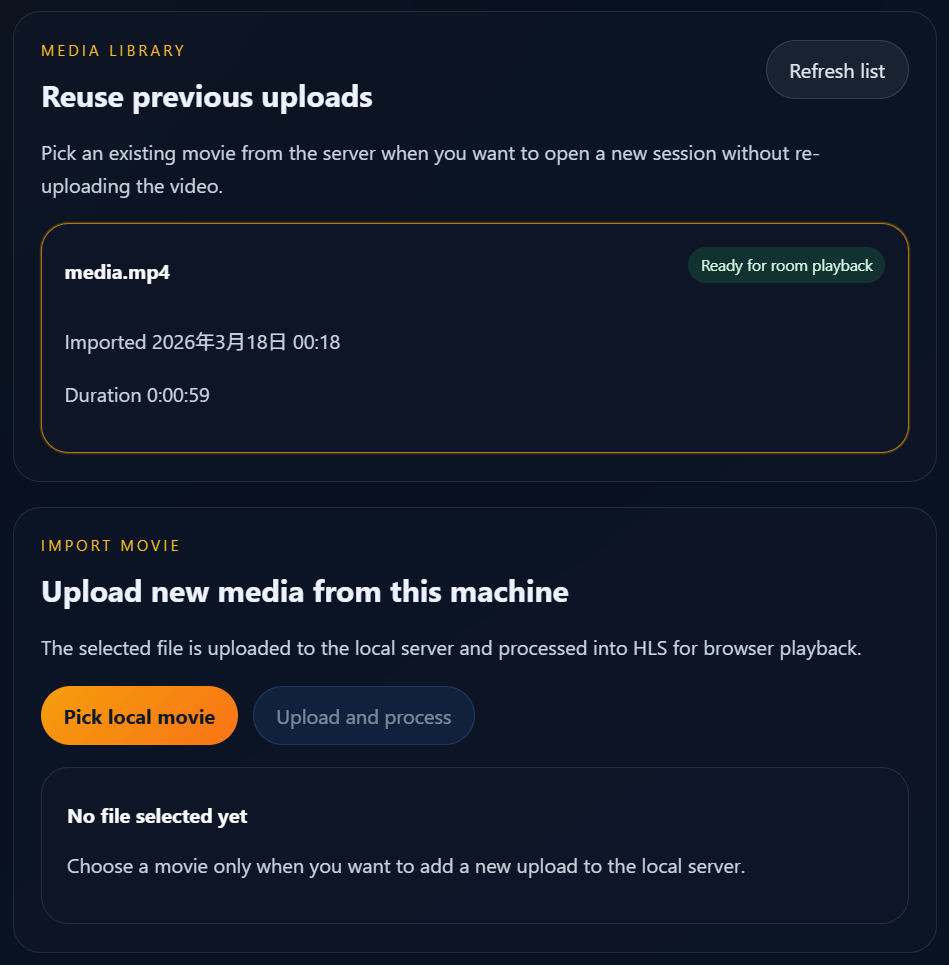
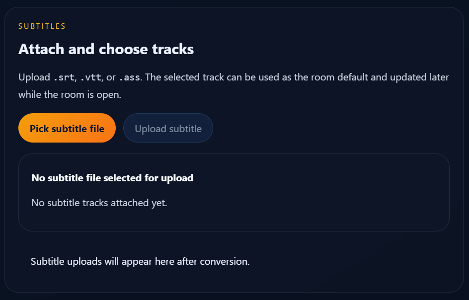
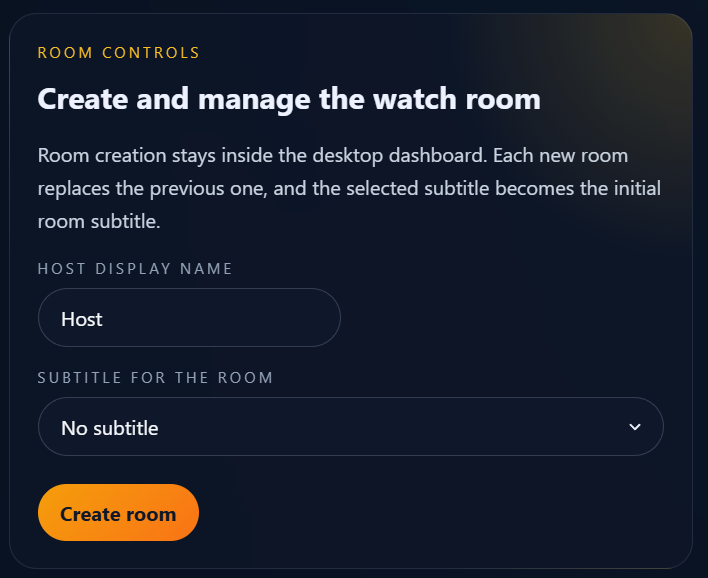
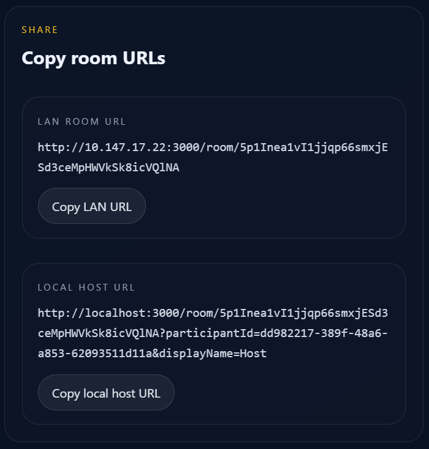

最近我迷上了[绝命毒师](https://www.netflix.com/sg-zh/title/70143836), 并且成功带着女朋友入坑. 不幸的是, 我们并不在同一座城市上大学, 因此很多时候只能在线上一起追剧. 像任何一个正常人一样, 我的第一选择是腾讯会议的投屏功能. 然而, 这个解决方案并不令人满意: 
1. 清晰度受限: 简直白瞎了我下载的 1080p 视频!!!
2. 不稳定: 一旦网络环境抖动, 画质就会断崖式下跌, 甚至直接卡成 PPT. 

为了解决这个问题, 我还调研了一些其他项目, 发现它们各有优劣, 但都不能完美契合我的需求. 不过我还是在这里列出这些项目, 供大家参考: 
- [Sunshine](https://github.com/LizardByte/Sunshine) + [Moonlight](https://moonlight-stream.org/) 串流: 这个方案能够将电脑屏幕实时串流到远程设备上. 然而, 它对网络环境极其敏感(就我个人的体验来说, 要想流畅串流, 对梯子或内网穿透的要求还是蛮高的), 且被串流的一方无法控制播放进度, 因此果断 Pass. 
- [VideoTogether](https://videotogether.github.io/zh-cn/) (写到这里我才惊觉撞名字了 QAQ): 可以通过浏览器插件同步观看视频. 然而, 它只能观看线上视频, 或者是双方本地都拥有的电影 -- 每次看电影前都要双方各自下载同一个大文件? 这也太麻烦了吧!
- [SyncPlay](https://syncplay.pl/): 需要一台额外的服务器做中继, 且部署和配置颇为繁琐. 

要是有一个电影共享神器, 能够: 
- 共享本地的高清视频 (以及外挂字幕)
- 双方都能随心所欲地控制进度条
- 对网络要求不高, 完全不需要中继服务器
- 配置极简, 开箱即用

**那该有多好哇!**

既然市面上没有现成的完美方案, 那干脆我自己动手撸一个吧!

Introducing ***[VideoTogether](https://github.com/TenofHearts/VideoTogether)***...

---

## 功能介绍

VideoTogether 包含三大核心组件: 
1. `server`: 一个本地服务端, 负责处理视频媒体数据, 实时同步房间播放进度等核心逻辑. 完美摆脱了额外服务器的束缚, 可直接在本地机器部署. 
2. `web`: 播放视频的网页前端. 
3. `desktop`: 一个与服务端相连的控制台客户端, 可以用来上传 / 删除视频和外挂字幕, 以及建立放映室. 

一起看电影的双方, 其中一人(通常是拥有电影文件的一方)充当 Host, 利用这套工具初始化处理并托管视频, 将数据无缝投递给 Guest; 而 Guest 一方只需打开浏览器, 复制粘贴 Host 丢来的放映室链接, 就可以一起看电影啦~

Host 用户首先需要从 GitHub 克隆源码, 安装配置完依赖环境后, 只需一键运行: 

```bash
npm run host:start
```

上述三大组件便会自动运行: 在弹出的控制面板中丢进去视频和字幕后


就可以创建房间, 并且分享房间链接


将 `LAN Room URL` 分享给朋友, 自己打开 `Local Host URL`, 就可以一起开心地看电影啦~ 在看电影的过程中, 任何一方暂停, 播放, 拖动进度条的行为都会同步给另一方, 这样即使身在异地, 也可以沉浸式地一起看电影. 

## 环境配置

为了实现服务器的功能, 编译各个组件, 我们需要下载一些工具. **注意, 这些工具只有Host需要下载, Guest仅仅需要打开链接就可以啦~**

> **注意:** 具体的某些细枝末节配置可能会在这里省略, 强烈建议搭配官方 [README](https://github.com/TenofHearts/VideoTogether/blob/main/README.md) 食用以获得完整体验. 

### Node.js

我的框架整体上由 TypeScript 搭建, 因此需要 `Node.js` 运行这个框架. `Node.js` 的下载方式十分简单, 这里提供几种方式: 
1. [官网](https://nodejs.cn/download/)下载: 推荐一般用户使用
2. 使用[FNM](https://fnm.nodejs.cn/docs/#installation)下载: 推荐专业用户使用

### NPM

`NPM` 是 `Node.js` 的包管理器, 能够帮助你下载和管理社区提供的外部包和工具. 下载方式十分简单, 可以直接在[官网](https://npm.nodejs.cn/cli/v11/configuring-npm/install)下载

### FFMPEG

ffmpeg 是一个开源的媒体处理工具, 很多我们日常会接触到的多媒体处理软件都在使用. 下载方式十分简单, 在[官网](https://ffmpeg.org/)下载即可, 下载完以后不要忘记[配置环境变量](https://zhuanlan.zhihu.com/p/646247339)哦~

### Rust 构建环境

VideoTogether 的 `desktop` 组件是由 Rust 语言实现的, 因此需要 Rust 编译工具链来构建. 直接在[官网](https://rust-lang.org/tools/install/)下载即可. 

## 使用 Tips

实操时, 眼尖的朋友可能会发现, 我们生成的链接仅仅是一个内网 IP (例如 10.147.x.x 等), 而非公网 IP. 仔细听讲过初中信息课的同学该发问了: 难道俩人非得挤在同一个局域网连着同一台路由器才能使用 VideoTogether 吗?

当然不是啦! 我们只需使用 [ZeroTier](https://www.zerotier.com/), 就能轻松组建一个 P2P 虚拟局域网. 这能让你安全稳定地跨越物理距离, 即便是千里之外的异地, 也能通过这张虚拟大网直接串门你的电脑啦!

> ### Gemini 说
> #### 互联世界的“门牌”与“隔断”: 公网 IP 与内网解析
> 在互联网的浩瀚海洋中, 每一个设备想要通信, 都必须有一个身份标识. 我们可以通过一个简单的比喻来理解 **公网 IP** 与 **内网** 的关系. 
> ##### 1. 公网 IP: 全球唯一的“大厦地址”
> **公网 IP** 就像是一个真实的, 全球唯一的 **街道门牌号** (例如: 长安街 100 号). 无论你身处世界的哪个角落, 只要拨打这个地址, 数据包就能准确无误地找到对应的“大厦”. 它是互联网骨干网可以直接路由的地址, 代表了设备在广域网中的直接存在. 
> ##### 2. 内网: 大厦内部的“房间号”
> **内网** (局域网) 则像是大厦内部的 **办公室编号** (例如: 302 室). 
> * 每个公司 (家庭, 学校) 都可以拥有自己的“302 室”. 
> * 这些编号仅在内部有意义, 但如果你在大街上随便拦住一个人问“302 室在哪?”, 对方是完全懵逼的, 因为他并不知道你说的是哪栋楼的“302”. 
> ##### 3. 为什么内网 IPv4 无法从外部直接访问? 
> 这源于 IPv4 地址资源的稀缺性以及 **NAT (网络地址转换)** 机制的设计, 核心原因不出这三点: 
> * **地址重叠 (Ambiguity):** 全世界有亿万个内网都在用 `192.168.1.1` 这个地址. 如果你在广域网发起请求, 路由器上哪分得清究竟发给哪家的“1.1”. 
> * **路由屏障:** 互联网核心路由器 (ISP) 的规则是直接 **丢弃** 或忽略所有私有 IP 数据包. 这些包一旦试图突破路由器防线进入公网, 就会遭到无情剿灭. 
> * **NAT 这种“传达室”机制:** 内网的小喽啰要闯荡外网, 必须托路由器 (NAT) 将其临时伪装成公网 IP. 而外部发起的连接请求, 如果没有提前在传达室大爷那做好“端口映射”, 就像快递小哥到了大厦门口两眼一黑, 完全不知道该投到哪个分机, 连接建立便无从谈起. 
> ---
> **总结:** 公网 IP 是唯一名片, 内网 IP 则是内部代号. 内网的初衷正是在节约 IP 资源的同时, 顺便为内部设备套上一层天然的“防撞层”. 

---

以上, 就是 VideoTogether 的功能和使用教程, 稍微有一点计算机经验的朋友们大概在10分钟左右即可完成, 0经验的小白也可以在一两个小时内完全摸索出来. 遇到任何问题可以在项目的 Github 页面投 issue, 或者向我发邮件询问. 

## 写在最后

也许有朋友们已经猜到了, 这个项目是我在两天的时间里, 花了十几块钱, Vibe Coding 出来的一个项目, 里面的每一行代码, 全都是由 AI 完成的. 我甚至都不怎么会 TypeScript 和 Rust!

看着这套方案在我眼前跑通, 我不禁陷入了沉思: **AI 都这么猛了, 那未来的程序员还能有什么价值?**  我认为大概可以总结为以下几点: 
1. 对于计算机的熟悉. 配置环境, 设计技术栈, 编程语言的选择, 软件框架的设计(虽然其实设计的不是很好), 乃至于软件功能的设计, 这些都离不开对计算机的了解. 
2. 程序设计经验. 代码风格的设计, 代码审核, 这些从根本上决定了一个项目能"走多远"的事情, 已经成为了这个时代软件开发最重要的能力之一. 
3. 提需求的能力. 从功能设计, 到 UI 设计, 这个能力决定了一个软件是否有用. 

这些能力, 的确是我的 CS 教育留给我的宝贵财富, 但是并不是什么难以获得的天赋. 换句话说, 只要能够通过学习获得这些能力, 任何人都能几乎无成本地去开发一个软件, 去解决一个自己的问题, 去帮助身边的人, 去改变世界...