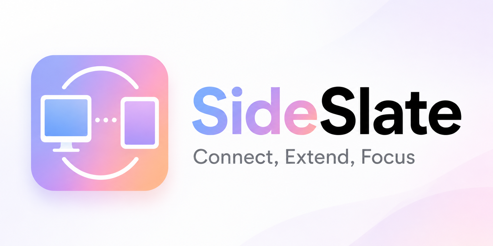
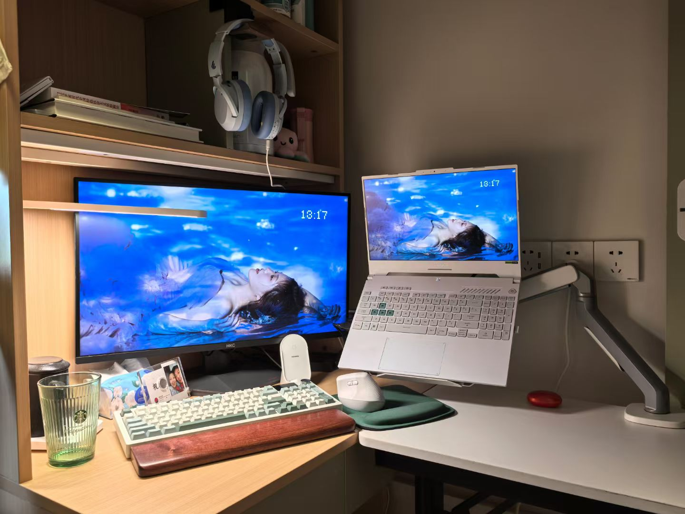
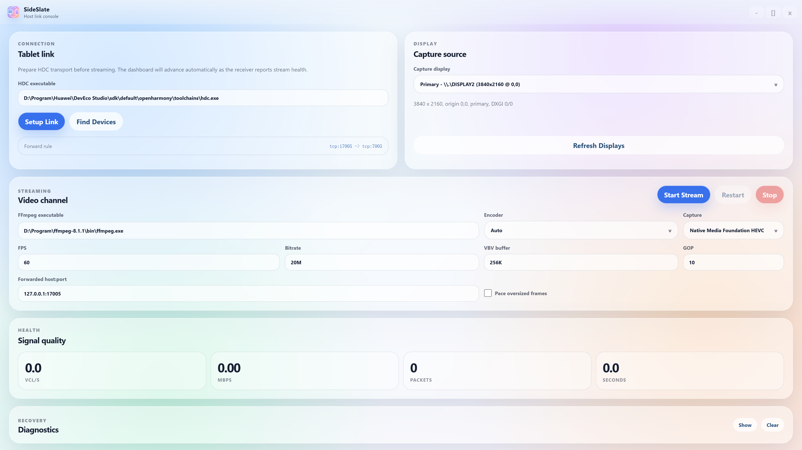

> “Once you have that large display area, you’ll never go back, because it has a direct impact on productivity.” — Bill Gates
## 前言

如果大家不知道的话, 我去年买了一块显示屏, 从那天起, 我便感觉打开了新世界的大门. ~~(好吧没有那么夸张, 但我真的很爱有两块屏幕的感觉)~~ 从工作的角度来说, 我可以一边写代码一边看文档; 从娱乐的角度来说, 我可以一边打游戏一边看视频...... 用两块显示屏真的让我的生活变得方便了很多. 

但是显示屏我可不能随身携带啊, 那我上课的时候怎么办? 当然是把我的平板变成我的副屏啦. 

现在市面上其实有很多解决方案. 我认为最好用的, 也是一个开源的解决方案, 就是 [Sunshine](https://github.com/LizardByte/Sunshine) + [Moonlight](https://github.com/moonlight-stream/moonlight-android) 串流. Sunshine 的是自托管的 Moonlight 串流主机, 负责采集画面, 编码和传输; Moonlight 是兼容其协议的客户端, 负责接收, 解码, 显示, 并可回传输入. 这两个软件的使用方式大家在 Bilibili 上搜索就能找到, 我在这里就不赘述了. 这两个软件通常的用途是进行游戏画面的远程串流, 它能够将远程主机上的游戏画面串流到平板上, 并且你的操作再返回到远程的电脑上, 从而实现远程打游戏的目的. 不过, 我们只需要使用类似 [Parsec Virtual Display](https://github.com/nomi-san/parsec-vdd) 的软件创建一个虚拟的显示屏, 并将这个虚拟显示屏的画面串流到平板上, 我们就有一个不错的副屏啦. 

> Windows 提供了无线显示相关功能, 而部分 Android 平板也提供了第二屏或跨设备协同能力. 不过在我自己的设备和网络环境中, 它们的体验仍不如 Sunshine + Moonlight. 此外, 我用的是华为平板 ~~伏笔~~, 而出于众所周知的原因, 华为平板不能使用高版本安卓的功能. 

Sunshine 和 Moonlight 是通过网络协议通信的, 在网络条件较好时体验很好, 但是学校的网络环境嘛...... 同时, 既然我们的需求是做副屏, 那么我们其实最好可以通过某种有线连接来代替无线连接, 这样能有更好的带宽, 也就有了更好的体验. 一个解决办法是通过平板的"USB共享网络"功能, 简单来说就是通过一根 USB 线将平板和电脑连到一个虚拟局域网中, 允许它们之间进行网络协议通信. 这样, Sunshine 和 Moonlight 仍然可以使用原本的网络协议工作, 只是底层承载从 Wi-Fi 换成了 USB 有线链路. 实际带宽取决于设备, 线材和 USB 规格, 但在复杂的校园网络环境中, 有线链路通常会带来更稳定的连接和更低的抖动. 

**Perfect, Right?** 
## SideSlate

前两天, 我的平板升级到了 HarmonyOS 6, "USB 共享网络"功能直接消失了. 在与客服进行了一番友好交流之后, 我悲伤地了解到这个功能的确是消失了. 我不知道华为的工程师是出于什么样的考虑才决定将一个低版本系统中有的, 且很好用的功能在高版本删掉. 对此我只想说: 

**谢谢你, 华为**

不过既然我们不能继续通过"USB共享网络"功能获得更快的网络连接, **我为什么不能直接写一个通过 USB 协议通信的副屏软件呢?**

这就是 SideSlate 的初衷. 

在 SideSlate 中, 我们只需要通过选择需要串流的显示屏, 在平板端启动 Client 接受数据, 就可以享受低延迟高分辨率的串流体验啦!

> BTW, 当前版本的 SideSlate 并没有直接实现自定义的 USB 数据通道, 而是借助 HDC 的端口转发能力, 在 USB 线缆承载的链路上建立普通的 TCP Socket 通信. 因此，使用前需要在开发者模式中开启"USB 调试", 并授权电脑与平板建立调试连接. 
> 那为什么不直接使用原始 USB 通信呢? 
> 简单来说, 电脑与平板通过 USB 连接时, 通常由电脑充当 USB Host, 平板作为 USB Device. 要让应用层直接进行自定义 USB 数据传输, 不仅需要桌面端正确处理 USB interface 和 endpoint, 还需要平板系统向应用暴露可用, 稳定的读写接口. 
> AOA 是一种可行方向: 它可以让电脑作为 USB Host, 将 Android 设备切换到 Accessory Mode, 再通过 USB bulk endpoint 传输数据. 但在我对我的平板的测试中，AOA 的控制阶段虽然能够完成, 但是返回的文件描述符却无法读写. 
> 对此我只想说：
> > **谢谢你，华为。**

---

以上就是这篇文章的全部内容了. 我的本意是推荐和讲解一下 Sunhine + Moonlight 这个非常好用的串流方案, 并且表达我对华为的工程师无上的尊敬和崇拜之情. 虽然 SideSlate 是我自己开发的另一个开源解决方案, 但是我由于最近考试的原因, 还没有进行完整的测试, 因此我会在后续有时间后开源这个项目, 大家敬请期待. 