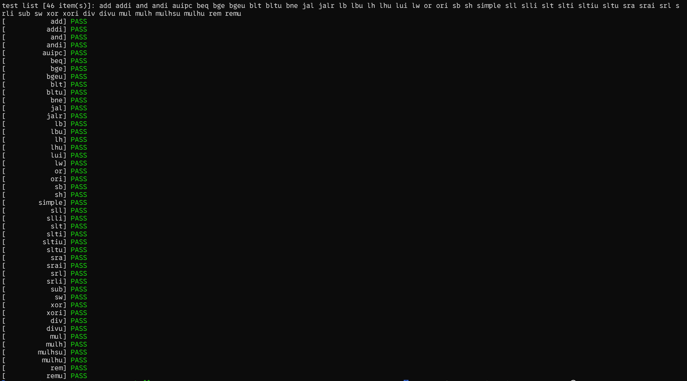
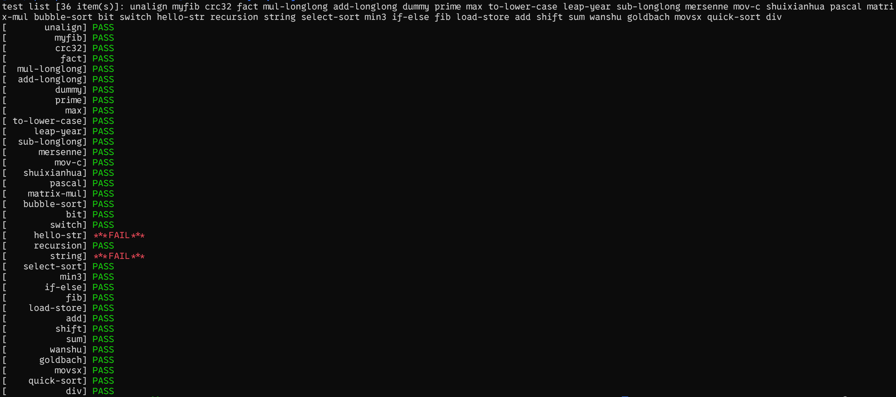
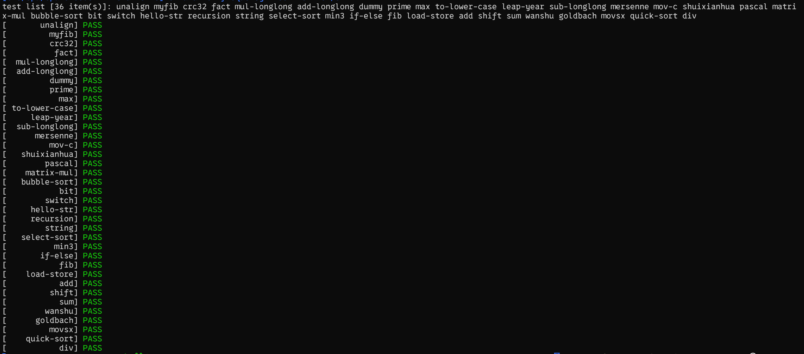

<!-- # PA from Scratch - Day 06 -->

## So Far...

So far, we have simulated a complete set of hardware systems supporting the Risc-V32 instruction set at the software level, including the CPU, memory, and registers. With such a hardware system, we can complete a series of basic calculations on this computer. Such a computer capable of various calculations is called a Turing Machine (TRM).

Below are some tests to prove the correctness of the instruction set implementation.



Below are some tests to prove the correctness of `C` programs executing on this machine ([Here](https://tenofhearts.github.io/2025-01-29-Day-05/) is a detailed introduction to how programs are executed).



> How to Debug? In PA, we can use the [simple debugger sdb](https://tenofhearts.github.io/2025-01-22-Day-02/) implemented in PA1 to debug programs that have errors. However, the reason these programs have errors is not that their own code is wrong, but that the behavior of our underlying instruction set is incorrect. Therefore, when debugging, we need to step through execution with `si` to confirm the erroneous instruction, and then use `p` to read the values in registers or memory to find discrepancies from expectations, thereby improving the underlying instruction implementation.

It can be seen that although we have correctly implemented all the instructions in the instruction set, we still **cannot correctly execute all programs**. Why is this?

**Is there any way to make our computer more powerful?**

## Abstract Machine

Students who have written programs all know that in our programs, apart from the functions we write ourselves, we usually have to call some library functions. A Library is a collection of software resources necessary in the process of writing programs. Some of them are extensions to the language, sparing programmers from repeatedly writing some common functions (like `numpy` and `pandas` in `python`); some encapsulate the functions of the underlying operating system or hardware, providing programmers with the ability to interact with the computer itself in the form of interfaces.

**Why are there libraries?** Let's imagine a world without library functions. First, without libraries, programmers would need to waste a lot of time repeatedly implementing basic functions (like quicksort, binary search tree); more seriously, because some library functions need to interact with the underlying operating system or hardware, their implementations on different platforms are different, which would also cause programmers to have to write different code for different platforms, greatly increasing the workload and the difficulty of code maintenance.

Take the Windows system as an example. sometimes after downloading software, everyone will find a bunch of files with the `.dll` suffix in the folder. These files are dynamic-link libraries, which contain the libraries needed to run the software, providing them with a **runtime environment**. Deleting these files will cause errors. (If you don't feel safe messing with your own software, you can go [here](https://github.com/TenofHearts/Playground_Run) to download a small game I made during my freshman year, and experiment with the dynamic-link libraries in it!)

---

Let's look at the two programs that had errors, `hello-str.c` and `string.c`. Taking `string.c` as an example, its code is as follows:
```C
  1 #include "trap.h"
  2
  3 char *s[] = {
  4   "aaaaaaaaaaaaaaaaaaaaaaaaaaaaaaaaaaaaaa",
  5   "aaaaaaaaaaaaaaaaaaaaaaaaaaaaaaaaaaaaab",
  6   "aaaaaaaaaaaaaaaaaaaaaaaaaaaaaaaaaaaaaa",
  7   ", World!\n",
  8   "Hello, World!\n",
  9   "#####"
 10 };
 11
 12 char str1[] = "Hello";
 13 char str[20];
 14
 15 int main() {
 16   check(strcmp(s[0], s[2]) == 0);
 17   check(strcmp(s[0], s[1]) < 0);
 18   check(strcmp(s[0] + 1, s[1] + 1) < 0);
 19   check(strcmp(s[0] + 2, s[1] + 2) < 0);
 20   check(strcmp(s[0] + 3, s[1] + 3) < 0);
 21
 22   check(strcmp( strcat(strcpy(str, str1), s[3]), s[4]) == 0);
 23
 24   check(memcmp(memset(str, '#', 5), s[5], 5) == 0);
 25
 26   return 0;
 27 }
```

Among them, the `check` function is a function used to determine the correctness of the implementation, which we don't need to worry about here. What can be noticed is that there are many functions like `strcmp`, `strcat`, etc. in the code, all of which come from the `string` C standard library. However, since this code is running on the RiscV32-nemu platform I wrote myself, I must implement these library functions myself.

`Abstract Machine` is another project provided in PA, which contains the runtime environment needed to run programs on nemu.

```
NEMU provides hardware functions --> AM provides program runtime environment --> Run programs
```

Starting today, our work will change to gradually enriching the content of `AM`, thereby making our machine more powerful.

After implementing parts of `string.c` and `stdio.c`, the test points that previously couldn't be passed also passed~



Yay!
