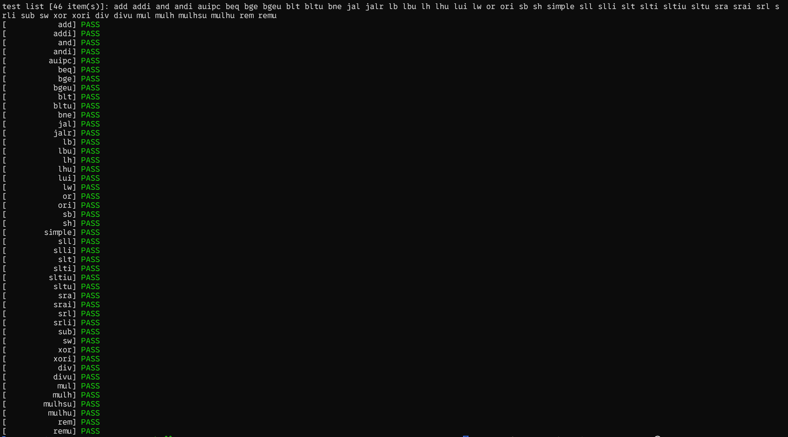
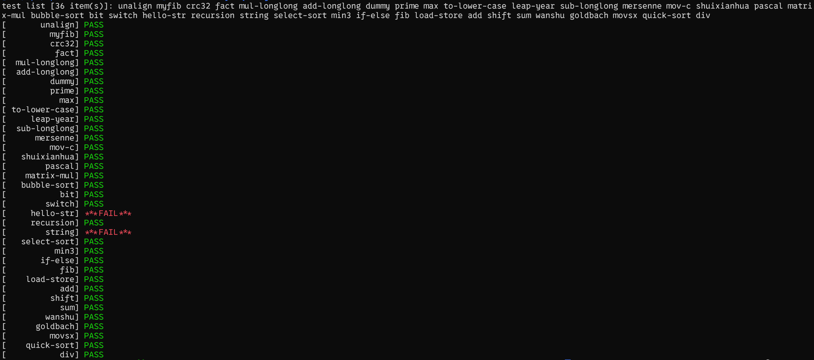
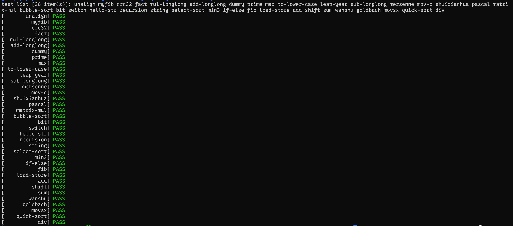

<!-- # 从0开始写PA-Day06 -->

## So Far...

目前为止, 我们在软件层面模拟出了一整套支持Risc-V32指令集的硬件系统, 包括CPU, 内存, 和寄存器. 有了这样一套硬件系统, 我们就能够在这样一台计算机上完成一系列基础的计算的基础程序. 这样一台能进行各种计算的计算机被称为图灵机(Turing Machine, TRM)

一下是一些测试, 用以证明指令集实现的正确性. 



一下是一些测试, 用以证明`C`程序在该机器上执行的正确性([这里](https://tenofhearts.github.io/2025-01-29-Day-05/)详细介绍了程序是如何执行的). 



> 如何Debug? 在PA中, 我们能使用在PA1中实现的[简易调试器sdb](https://tenofhearts.github.io/2025-01-22-Day-02/)对出错的程序进行调试, 然而, 这些程序出错的原因并不是其本身代码有错, 而是我们底层的指令集行为有错误. 因此, 在调试时, 我们需要通过单步执行`si`确认出错的指令, 再通过`p`读取寄存器或内存中的值, 发现于预期的差异, 从而对底层的指令实现进行改进. 

可以看到虽然我们已经正确实现了所有指令集中的指令, 但是仍然**不能正确执行所有的程序**. 这是为什么呢?

**有没有什么办法让我们的计算机更强大呢?**

## Abstract Machine

写过程序的同学们都知道, 在我们的程序中, 除了自己写的函数之外, 我们通常必须要调用一些库函数. 库(Library)是在编写程序的过程中所必要的软件资源的集合, 它们有的是对语言的扩展, 使程序员不必反复编写一些常用功能(如`python`中的`numpy`, `pandas`); 有些则是将底层操作系统或硬件的功能进行封装, 以接口的形式向程序员提供与计算机本身交互的能力. 

**为什么要有库呢?** 让我们试想一个没有库函数的世界. 首先, 要是没用库, 程序员则需要浪费大量时间反复实现一些基础的功能(如快速排序, 二叉搜索树); 更严重的是, 由于部分库函数需要与底层操作系统或硬件进行交互, 因此它们在不同平台上的实现是不同的, 这也会导致程序员必须为不同平台编写不同的代码, 极大增加了工作量和代码的维护难度. 

以Windows系统为例, 大家有时下载了软件后会发现文件夹中有一堆`.dll`为后缀名的文件, 这些文件就是动态链接库, 其中就包含了运行软件所需要库, 为它们提供了**运行时环境**, 要是将这些文件删除就会导致错误. (大家要是不放心霍霍自己的软件的话, 可以去[这里](https://github.com/TenofHearts/Playground_Run)下载一个我大一期间做的小游戏, 用里面的动态链接库做做实验吧!)

---

让我们看看出错的两个程序`hello-str.c`和`string.c`. 以`string.c`为例, 其代码如下: 
```C
  1 #include "trap.h"
  2
  3 char *s[] = {
  4   "aaaaaaaaaaaaaaaaaaaaaaaaaaaaaaaaaaaaaa",
  5   "aaaaaaaaaaaaaaaaaaaaaaaaaaaaaaaaaaaaab",
  6   "aaaaaaaaaaaaaaaaaaaaaaaaaaaaaaaaaaaaaa",
  7   ", World!\n",
  8   "Hello, World!\n",
  9   "#####"
 10 };
 11
 12 char str1[] = "Hello";
 13 char str[20];
 14
 15 int main() {
 16   check(strcmp(s[0], s[2]) == 0);
 17   check(strcmp(s[0], s[1]) < 0);
 18   check(strcmp(s[0] + 1, s[1] + 1) < 0);
 19   check(strcmp(s[0] + 2, s[1] + 2) < 0);
 20   check(strcmp(s[0] + 3, s[1] + 3) < 0);
 21
 22   check(strcmp( strcat(strcpy(str, str1), s[3]), s[4]) == 0);
 23
 24   check(memcmp(memset(str, '#', 5), s[5], 5) == 0);
 25
 26   return 0;
 27 }
```

其中`check`函数是用于判断实现正确性的函数, 这里我们可以不用管他. 可以注意到的是, 代码中有诸多如`strcmp`, `strcat`等函数, 这些函数都来自`string`这个C标准库. 然而, 由于这段代码实在我自己写的RiscV32-nemu平台上运行的, 因此, 我必须自行实现这些库函数. 

`Abstract Machine`是PA中提供的另一个项目, 其中包含了在nemu上运行程序所需的运行时环境. 

```
NEMU提供硬件功能 --> AM提供程序运行时环境 --> 运行程序
```

从今天开始, 我们的工作将变为逐步丰富`AM`的内容, 从而使我们的机器变得更加强大. 

在实现了`string.c`和`stdio.c`的部分之后, 之前通不过的测试点也通过啦~



耶! 