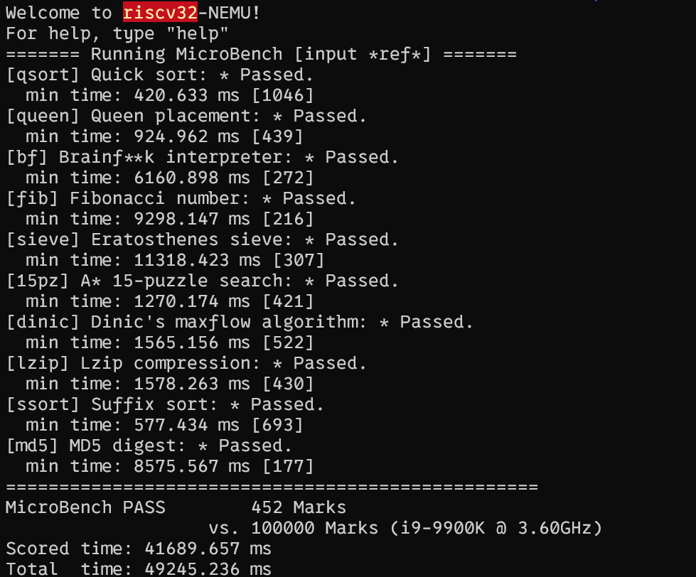
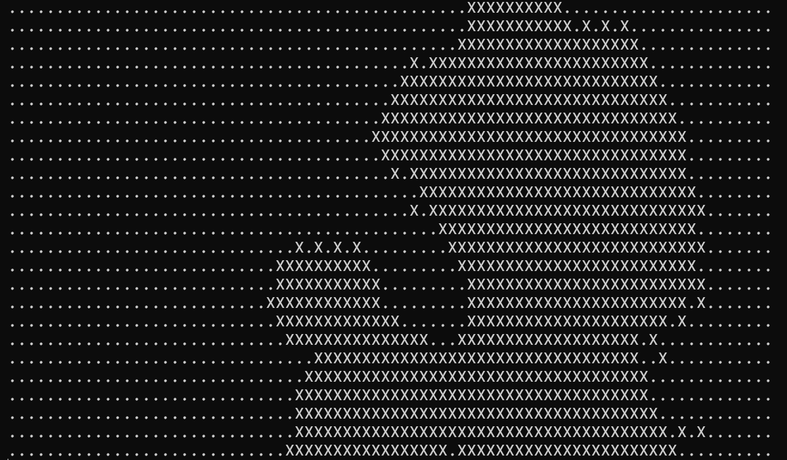
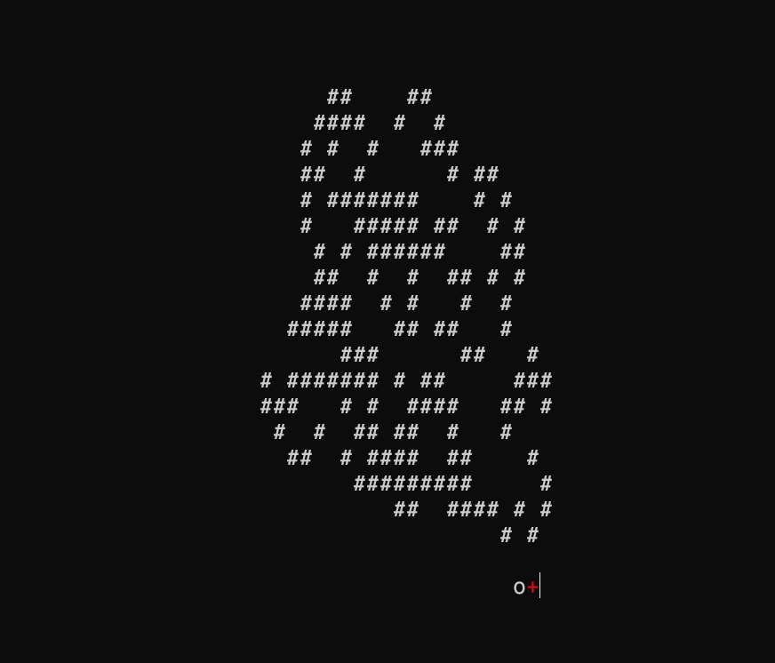
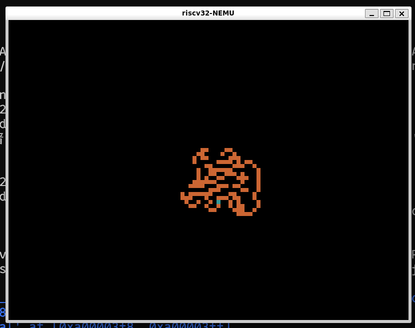
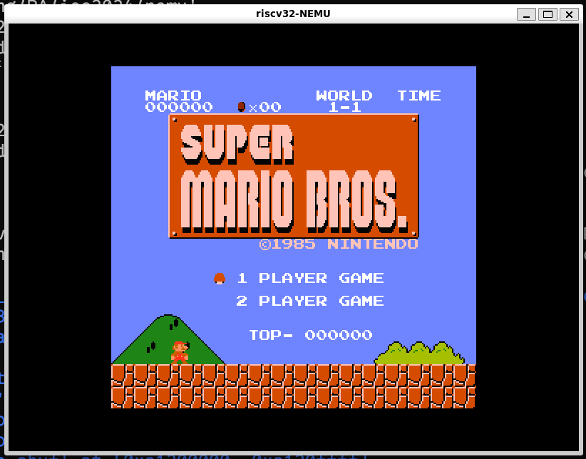
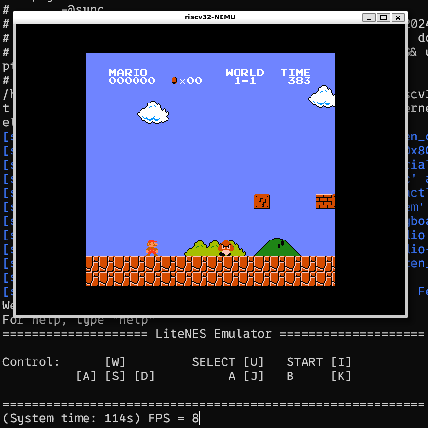

In the last PA, we built a C language runtime environment for our hardware system (NEMU). This way, we can run any C language program that executes computational tasks on this computer! However, such programs are still quite far from the programs in our real lives. For example, currently we cannot run games on our virtual machine, nor can we run some benchmarking programs on the virtual machine. This is so disappointing! Let's fix that!

In order to be able to run game-like applications on our virtual machine, we must be able to add functions such as timing, keyboard input, and rendering screens in the virtual machine. Therefore, today we are going to add IO devices such as clocks, keyboards, and GPUs.

## IO Devices

Input/output devices (IO devices) refer to the hardware systems in a computer system that can exchange data with the external world. We will introduce this from both hardware and software perspectives.

### Hardware

**I wonder if anyone has thought about this question:** How do IO devices like keyboards, mice, and displays communicate information with the CPU? A simple way is to use the device's registers as interfaces and let the CPU access these registers. For example, the CPU can read/write data from/to the device's data register to perform data input and output; it can read the device's status from the device's status register to ask if the device is busy; or it can write command words to the device's command register to modify the device's status.

> How does the CPU access its own registers? Inside the CPU, registers can be addressed one by one, and a register can be accessed by visiting the corresponding register address.

Similarly, we can address IO devices. Addressing methods can be mainly divided into two types: Port-Mapped I/O (PMIO) and Memory-Mapped I/O (MMIO).

#### Port I/O

The CPU uses specialized I/O instructions to access devices, and calls the address of the device the port number. Once there is a port number, by providing the port number in the I/O instruction, the system knows which device register to access.

x86 provides the `in` and `out` instructions for accessing devices, where the `in` instruction is used to transfer data from the device register into the CPU register, and the `out` instruction is used to transfer data from the CPU register into the device register. An example is using the `out` instruction to send a command word to the serial port:

```
movl $0x41, %al
movl $0x3f8, %edx
outb %al, (%dx)
```

The above code transfers the data 0x41 to the device register corresponding to port 0x3f8. After the CPU executes the above code, it will transfer the data 0x41 to a register in the serial port. After receiving it, the serial port finds that it needs to output a character 'A'; but for the CPU, it does not care how the device will process the data 0x41, it purely and honestly transfers 0x41 to port 0x3f8.

#### Memory-Mapped I/O

Port-mapped I/O takes the port number as part of the I/O instruction. This method is very simple, but it is also its biggest shortcoming. To be compatible with already developed programs, instruction sets can only be added to but not modified. This means that the size of the I/O address space that port-mapped I/O can access was already decided at the moment the I/O instructions were designed. The so-called I/O address space is essentially the set of addresses for all accessible devices. As devices become more numerous and their functions more complex, port-mapped I/O with its limited I/O address space can gradually no longer meet the demand. Thus, memory-mapped I/O (MMIO) came into being.

The memory-mapped I/O addressing method is very clever. It addresses devices using different physical memory addresses. This addressing method "redirects" the access of a portion of physical memory to the I/O address space. When the CPU attempts to access this portion of physical memory, it actually ends up accessing the corresponding I/O device, completely unknowingly to the CPU. After this, the CPU can access devices through ordinary memory access instructions.

At the same time, some devices require the CPU to access a relatively large continuous storage space, such as the video memory of VGA for a 1024x768 resolution with 24 colors plus an Alpha channel, which would need a 3MB addressing range.

This is also a unique advantage of memory-mapped I/O: both the physical memory address space and the CPU width will continuously grow, and memory-mapped I/O never needs to worry about running out of I/O address space.

> In principle, the only disadvantage of memory-mapped I/O is that the CPU can no longer directly access that physical memory which was mapped to the I/O address space through normal channels. But with the development of computers, the only disadvantage of memory-mapped I/O is becoming less and less obvious: modern computers are all 64-bit computers with 48 physical address lines, meaning the physical address space is 256TB large. Slicing out a 3MB address space for video memory from it is basically nothing.

## We can play games now!

After completing this series of IO devices, we can run some "normal" applications on the virtual machine!

### Benchmarking Software

First, after implementing the clock, we can use some benchmarking software to test the performance of the virtual machine.



Wow! 452 points! It has basically achieved $\frac{1}{1000}$ of the performance of the i9-9900K!

I guess the i9-9900K must be a **newly released, powerfully performing** CPU!


......

**QAQ**

### Watch MVs!

Also, after implementing the clock, we can watch MVs in the CLI!



The original MV is [here](https://www.bilibili.com/video/BV1x5411o7Kn/?spm_id_from=333.337.search-card.all.click&vd_source=d88495a90f71ec73f65ac145c434bc83). BTW, I haven't implemented the sound card yet, so I don't know how this song sounds.

### Play Games I

After implementing keyboard input, we can play games in the CLI interface!



Boring!

### Play Games II

After implementing the GPU, we can finally play games in a GUI! Let's first see what this hole-digging ant looks like in the GUI:



Isn't that amazing.

Or we can run a Famicom emulator on NEMU.





Look! 8 frames per second! What a smooth gaming experience!

---

This ends PA2.