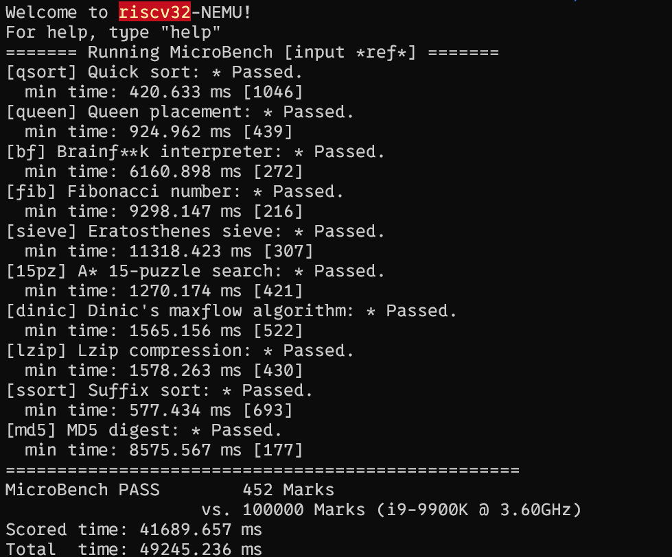
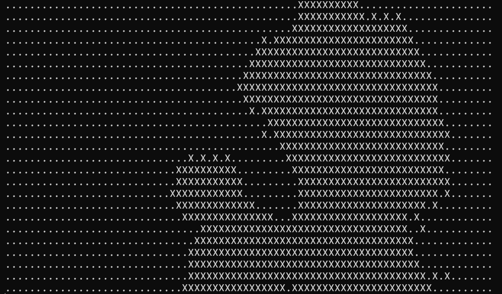
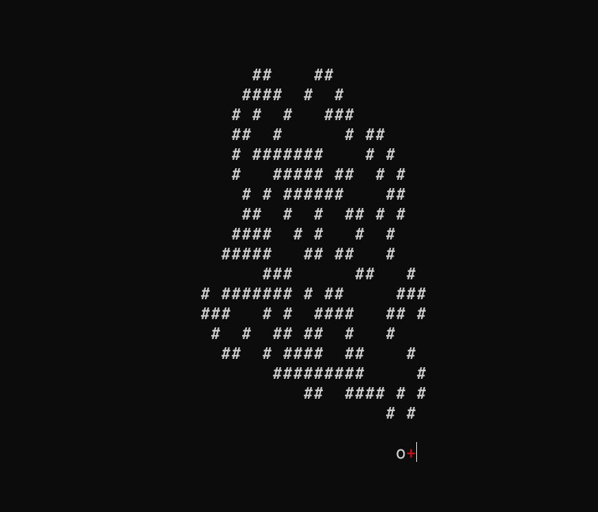
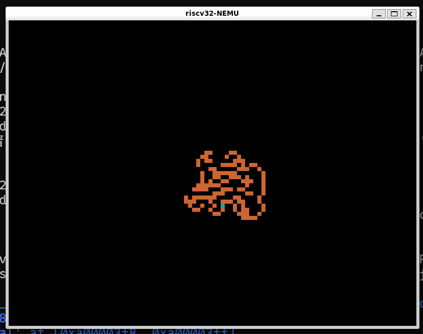
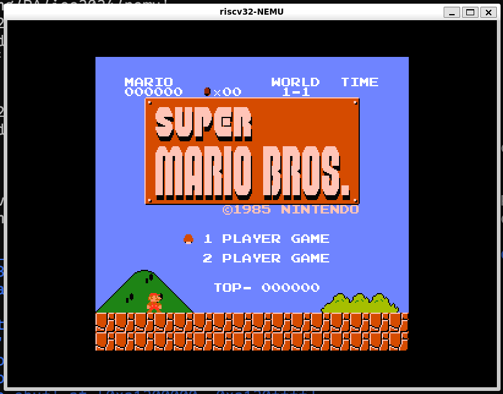
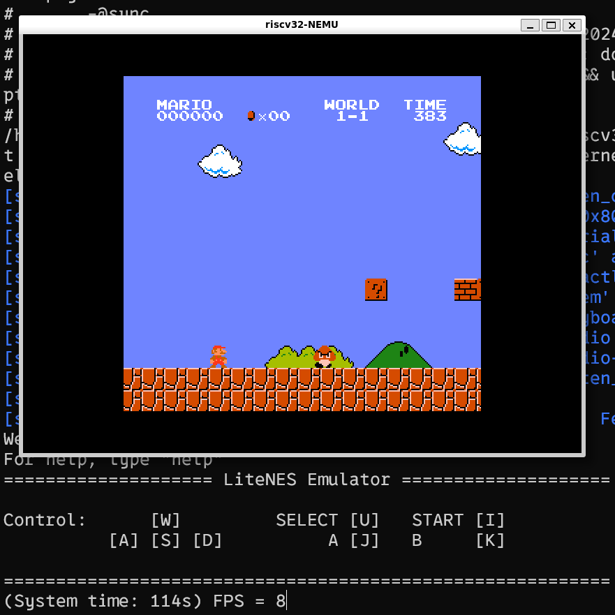

上一次PA中, 我们为我们搭建的硬件系统(NEMU)搭建了支持C语言的运行时环境. 这样, 我们就可以在这台计算机上任何执行计算任务的C语言程序啦! 然而, 这样的程序距离我们现实生活中的程序还有较远的距离. 比如, 目前我们就无法在我们的虚拟机上运行游戏, 也无法在虚拟机上运行一些跑分程序. 真是太令人失望了! Let's fix that! 

为了能够在我们的虚拟机上运行类似游戏的应用程序, 我们必须能够在虚拟机中添加计时, 键盘输入, 渲染画面等功能, 因此, 我们今天就要添加时钟, 键盘, GPU等IO设备. 

## IO设备

输入输出设备(IO设备), 指的是计算机系统中能够与外部世界进行数据交换的硬件系统. 我们将从硬件和软件两个角度进行介绍. 

### 硬件

**不知道大家有没有思考过这样一个问题:** 类似键盘, 鼠标, 显示屏这类IO设备是如何与CPU进行信息交流的呢? 一种最简单的方法就是把设备的寄存器作为接口, 让CPU来访问这些寄存器. 比如CPU可以从/往设备的数据寄存器中读出/写入数据, 进行数据的输入输出; 可以从设备的状态寄存器中读出设备的状态, 询问设备是否忙碌; 或者往设备的命令寄存器中写入命令字, 来修改设备的状态. 

> CPU是如何访问自己的寄存器的? 在CPU内部, 可以将寄存器逐一编址, 通过访问对应的寄存器地址来访问寄存器. 

同样地, 我们可以对IO设备进行编址, 编址方式主要可以分为两种方式: 端口I/O(Port-Mapped I/O, PMIO)和内存映射I/O(Memory-Mapped I/O, MMIO). 

#### 端口I/O

CPU使用专门的I/O指令对设备进行访问, 并把设备的地址称作端口号. 有了端口号以后, 在I/O指令中给出端口号, 就知道要访问哪一个设备寄存器了. 

x86提供了`in`和`out`指令用于访问设备, 其中`in`指令用于将设备寄存器中的数据传输到CPU寄存器中, `out`指令用于将CPU寄存器中的数据传送到设备寄存器中. 一个例子是使用`out`指令给串口发送命令字:

```
movl $0x41, %al
movl $0x3f8, %edx
outb %al, (%dx)
```

上述代码把数据0x41传送到0x3f8号端口所对应的设备寄存器中. CPU执行上述代码后, 会将0x41这个数据传送到串口的一个寄存器中, 串口接收之后, 发现是要输出一个字符A; 但对CPU来说, 它并不关心设备会怎么处理0x41这个数据, 只会老老实实地把0x41传送到0x3f8号端口. 

#### 内存映射I/O

端口映射I/O把端口号作为I/O指令的一部分, 这种方法很简单, 但同时也是它最大的缺点. 指令集为了兼容已经开发的程序, 是只能添加但不能修改的. 这意味着, 端口映射I/O所能访问的I/O地址空间的大小, 在设计I/O指令的那一刻就已经决定下来了. 所谓I/O地址空间, 其实就是所有能访问的设备的地址的集合. 随着设备越来越多, 功能也越来越复杂, I/O地址空间有限的端口映射I/O已经逐渐不能满足需求了. 于是内存映射I/O(memory-mapped I/O, MMIO)应运而生.

内存映射I/O这种编址方式非常巧妙, 它是通过不同的物理内存地址给设备编址的. 这种编址方式将一部分物理内存的访问"重定向"到I/O地址空间中, CPU尝试访问这部分物理内存的时候, 实际上最终是访问了相应的I/O设备, CPU却浑然不知. 这样以后, CPU就可以通过普通的访存指令来访问设备. 

同时, 有的设备需要让CPU访问一段较大的连续存储空间, 如VGA的显存, 24色加上Alpha通道的1024x768分辨率的显存就需要3MB的编址范围.

这也是内存映射I/O得天独厚的好处: 物理内存的地址空间和CPU的位宽都会不断增长, 内存映射I/O从来不需要担心I/O地址空间耗尽的问题. 

> 从原理上来说, 内存映射I/O唯一的缺点就是, CPU无法通过正常渠道直接访问那些被映射到I/O地址空间的物理内存了. 但随着计算机的发展, 内存映射I/O的唯一缺点已经越来越不明显了: 现代计算机都已经是64位计算机, 物理地址线都有48根, 这意味着物理地址空间有256TB这么大, 从里面划出3MB的地址空间给显存, 根本就是不痛不痒. 

## 可以玩游戏啦!

在完成这样的一系列IO设备后, 我们可以在虚拟机上运行一些"正常"的应用程序啦! 

### 跑分软件

首先, 在实现了时钟之后, 我们就可以用一些跑分软件测试一下虚拟机的性能了. 



哇! 452分欸! 基本上达到了i9-9900K性能的$\frac{1}{1000}$呢! 

我猜i9-9900K一定是一个**最新发布性能强大**的CPU吧!


......

**QAQ**

### 看MV!

同时, 在 实现了时钟之后, 我们就可以在CLI里看MV啦!



原版MV在[这里](https://www.bilibili.com/video/BV1x5411o7Kn/?spm_id_from=333.337.search-card.all.click&vd_source=d88495a90f71ec73f65ac145c434bc83). BTW, 我还没有实现声卡, 所以我不知道这首歌听起来怎么样. 

### 玩游戏I

实现了键盘输入之后, 我们就可以在CLI界面玩游戏啦!



Boring! 

### 玩游戏II

在实现了GPU之后, 我们终于可以在GUI中玩游戏啦! 让我们先看一下刚才这只挖洞的蚂蚁在GUI中看起来是什么样的: 



Isn't that amazing. 

或者我们也可以在NEMU上运行一个红白机模拟器. 





瞧瞧! 8帧每秒! 真是畅快的游戏体验呢! 

---

This ends PA2. 